# Tutorial
Be carefull we will be using high voltages
## Abstract
**Recent studies have shown that Ion Thrusters can be useful in our
atmosphere at replacing conventional propellers. We will build a low
power version.**

## Context
Taking my inspiration from the [Plasma Channel](https://www.youtube.com/watch?v=nrEBoPYS4ns) Here is the design accessible on GitHub.

Ion thrusters are the most developed electric engines intended for propelling large spacecraft during in-space maneuvers, offering the highest efficiencies at reasonable power and thrust levels. Their development and refinement are largely experimental, involving expensive and long 
iterative processes to reach an optimum configuration. Recent studies 
have shown that it can be useful in our atmosphere [^1] at 
replacing conventional propellers. This project will focus on using this 
technology to produce wind for the AOI project, to replace its propellers 
and help miniaturize the project. 
Today already exist multiple ion thrusters and types, most are used in 
space. 
The most interesting ones for this project are made for earth use cases, the 
MIT has made a plane as well as a buisness Roswell flight. They rely on high tensions(+ and -80kv). [^1] [^2]

## Skills
- Soldering
- 3D printing but you dont have to (GitHub)
- PCB miling but you dont have to (GitHub)

## Content 
First lets 3d print these parts 8 by Andoe/Cathode. we will be putting up 4 so let's print 24 of them.
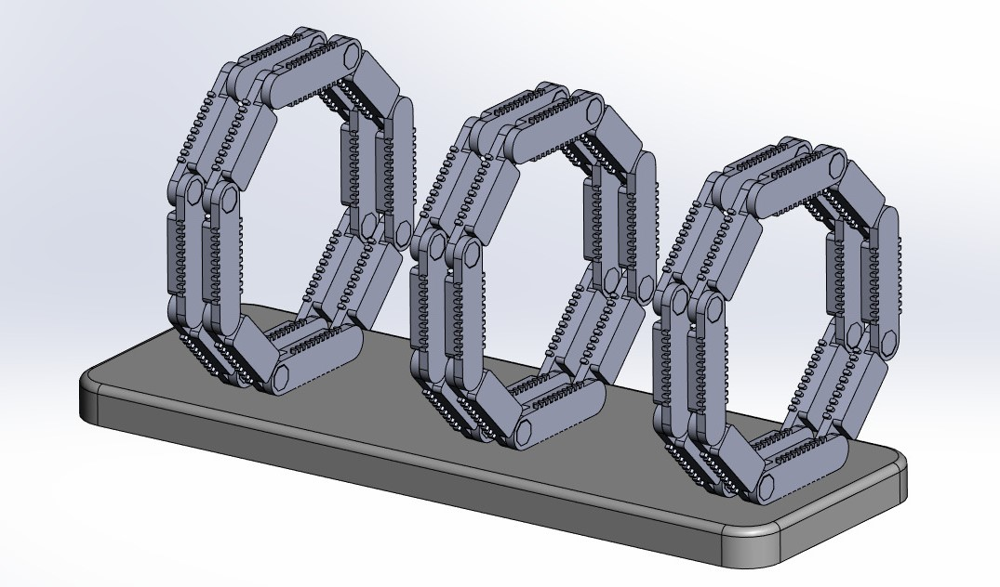
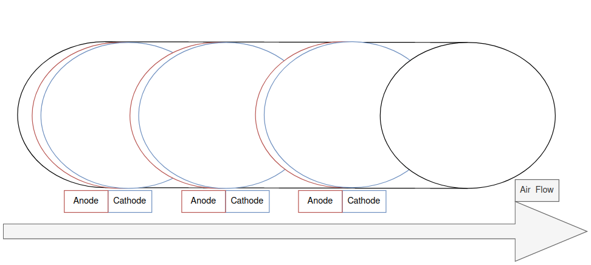

### What you will need
- Aluminium foil 

- thin Copper cables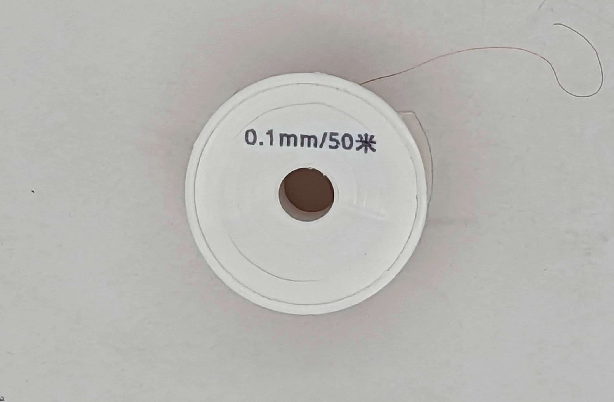

- A cut open usb cable
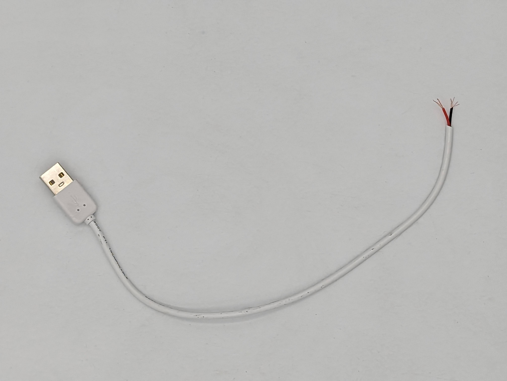

- A breadboard or prototype soldering board
@[split](2, begin)

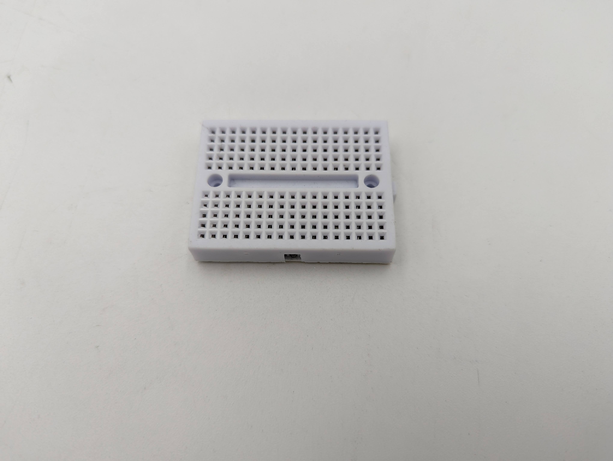

@[split](2, break)

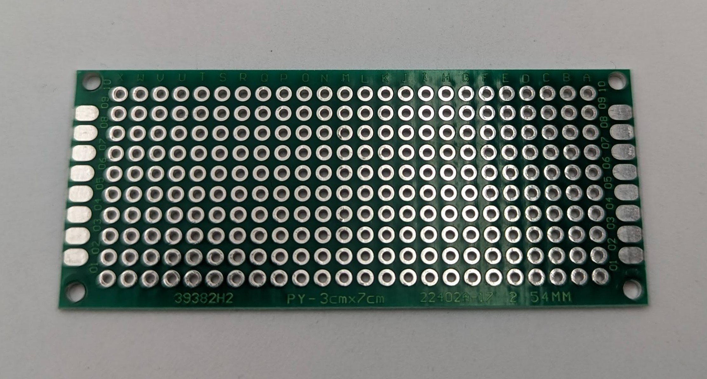

@[split](2, end)

- double sided tape
- led 
- 600 ohm resistor
- electronic cables

### Cathodes and Anodes
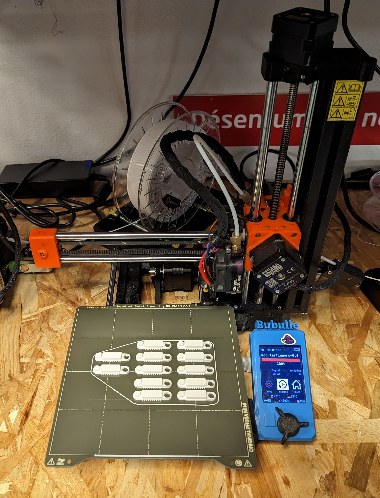

To make the cathodes
Here we want to fix the copper cables I used some hot glue, it needs to be tight.
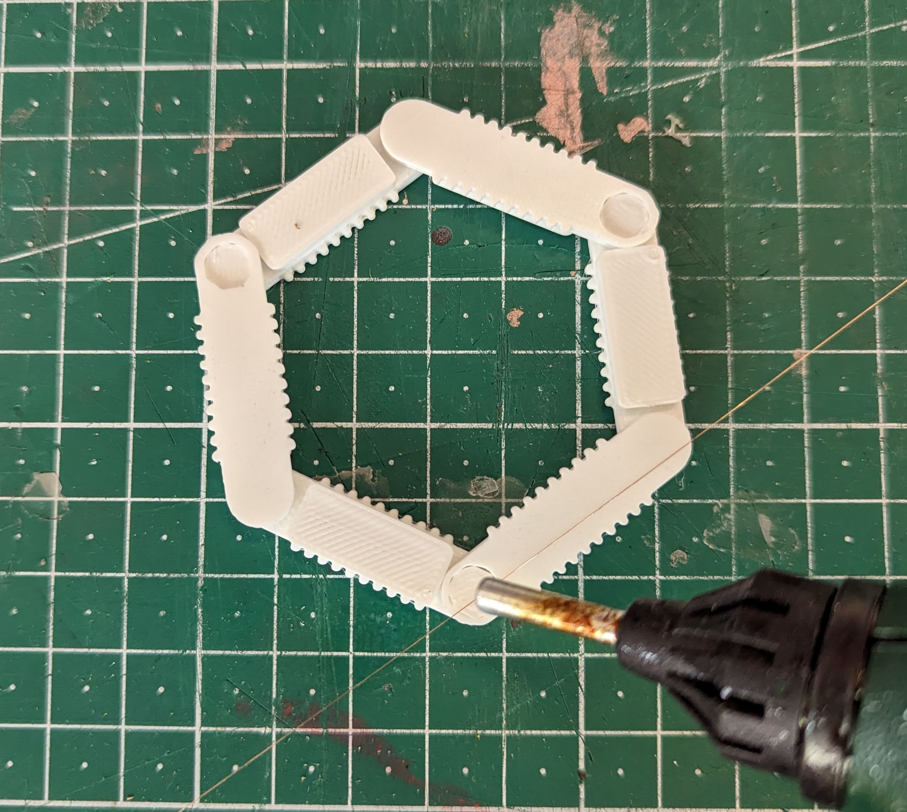

And make this piece twice.

Now lets make the anodes.
We will use here a very clean and plane aluminium foil
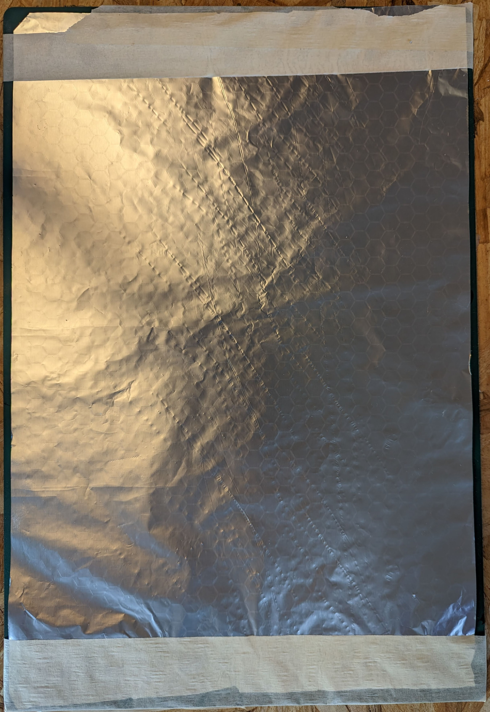
on which we can glue the arcs ideally with some dobble sided tape
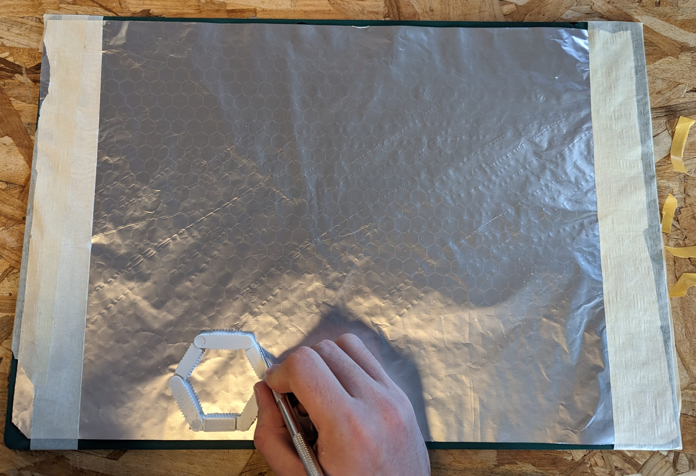
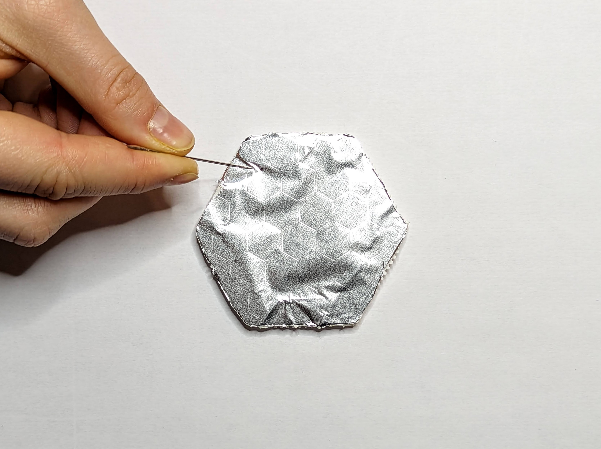
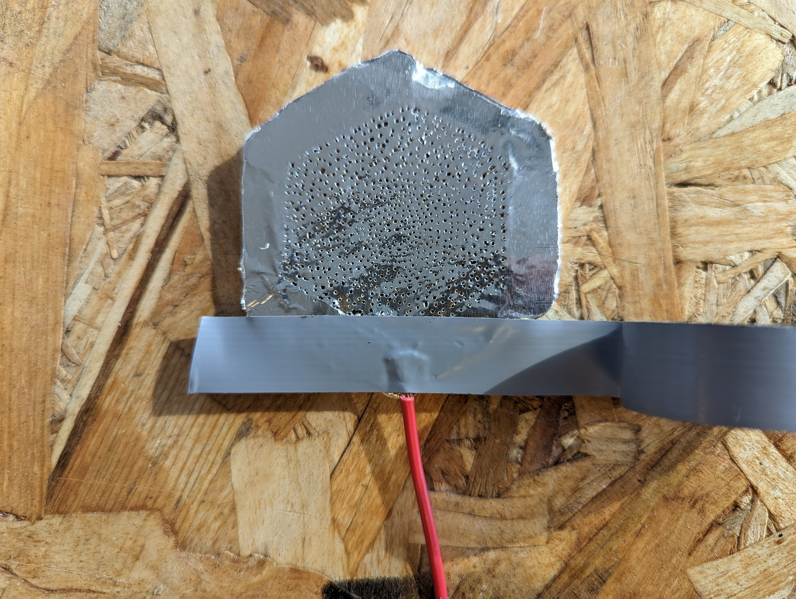

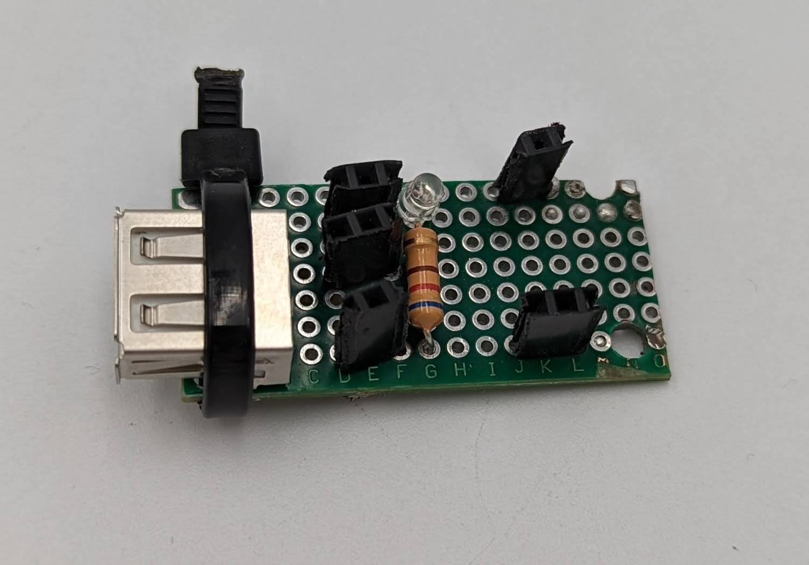

Fix the arcs on a plastic or other great insulator board
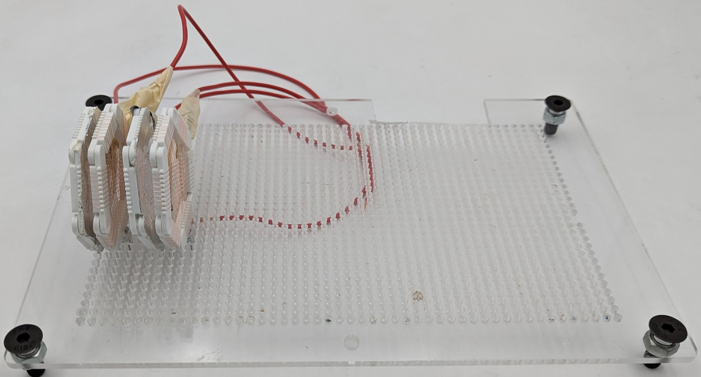

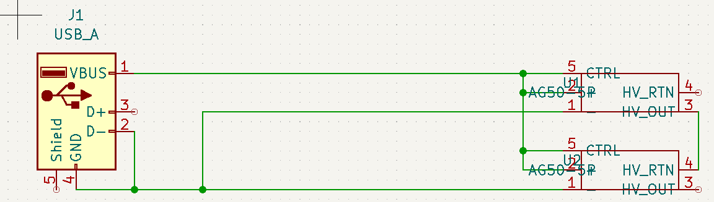
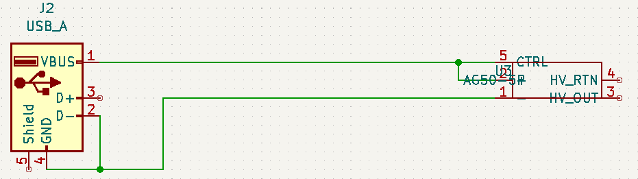

<!-- ## Stats on the propulsion system -->
## reproductability
I have asked two friend to re do some steps like the soldering of the circuit board which was hard without the the schematics so it was added. 
The whole driling part of the aluminium sheets to make the anodes is tricky as it can easily tear itself apart. and BBBBB 

## Conclusion
Based on recent studies, ion thrusters have shown potential in replacing conventional propellers on Earth. This project focused on using ion thruster technology to produce wind for the AOI project, replacing its propellers and helping to miniaturize the project. While most ion thrusters are used in space, there are already multiple ion thrusters made for Earth use cases, such as the MIT plane and Roswell flight, which rely on high tensions of + and -80kv. This project successfully demonstrated the building of a low-power ion thruster using 3D printing, PCB milling, and soldering skills. Reproducibility may require some trial and error, especially with the delicate process of drilling the aluminum sheets to make the anodes. Overall, this project shows the possibilities of ion thruster technology for Earth-based applications and its potential to revolutionize propulsion systems.

## Bibliography : 
[^1]: https://www.youtube.com/watch?v=TeJyMbSSUIc
[^2]: https://www.youtube.com/watch?v=UGM4JXVB5FM